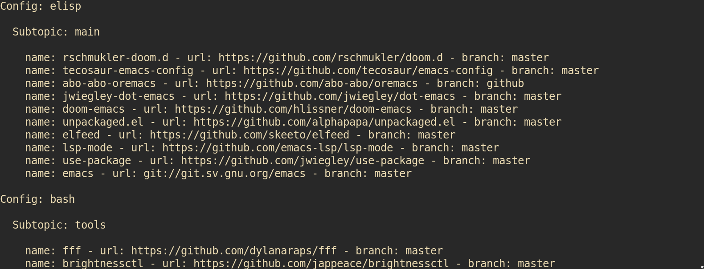

<!--
Onur is free software: you can redistribute it and/or modify
it under the terms of the GNU General Public License as published by
the Free Software Foundation, either version 3 of the License, or
(at your option) any later version.

Onur is distributed in the hope that it will be useful,
but WITHOUT ANY WARRANTY; without even the implied warranty of
MERCHANTABILITY or FITNESS FOR A PARTICULAR PURPOSE.  See the
GNU General Public License for more details.

You should have received a copy of the GNU General Public License
along with Onur. If not, see <https://www.gnu.org/licenses/>.
-->

# Onur

Easily manage multiple FLOSS repositories.
[c](https://gitlab.com/easbarba/onur-c) |
[go](https://gitlab.com/easbarba/onur-go) | [python](https://gitlab.com/easbarba/onur-python) | [rust](https://gitlab.com/easbarba/onur-rust) | [php](https://gitlab.com/easbarba/onur-php) | [java](https://gitlab.com/easbarba/onur-java) 

## USAGE

`Onur` consumes configuration in the following manners:

By default it looks for configuration files at `$XDG_CONFIG/onur` or in the directory set in the `$ONUR_CONFIG_HOME` environment variable.

```shell
onur grab
onur archive nuxt,awesomewm,gitignore
onur help
```

## INSTALLATION

`Onur` requires a [C++20](https://gcc.gnu.org/) compiler and [Meson](https://mesonbuild.com/), then just run `make clean all`, and executable file will be placed at `$PWD/.build/onur`.

Tip: A clean install without messing around your system is easily achievable with [GNU Guix](https://guix.gnu.org/manual/devel/en/html_node/Invoking-guix-shell.html): `guix shell --check`.

## CONFIGURATION FILE

A `onur` single configuration file:

```json
{
  "main": [
    {
      "name": "awesomewm",
      "url": "https://github.com/awesomeWM/awesome"
    },
    {
      "name": "nuxt",
      "branch": "main",
      "url": "https://github.com/nuxt/framework"
    }
  ],
  "misc": [
    {
      "name": "awesomewm",
      "url": "https://github.com/awesomeWM/awesome"
    },
    {
      "name": "nuxt",
      "branch": "main",
      "url": "https://github.com/nuxt/framework"
    }
  ]
}
```

More examples of configuration files are at `examples`.

## SETTINGS

```toml
single-branch = true
quiet = true
depth = 1
```

## SCREENSHOT



## LICENSE

[GNU GENERAL PUBLIC LICENSE Version 3](https://www.gnu.org/licenses/gpl-3.0.en.html)
